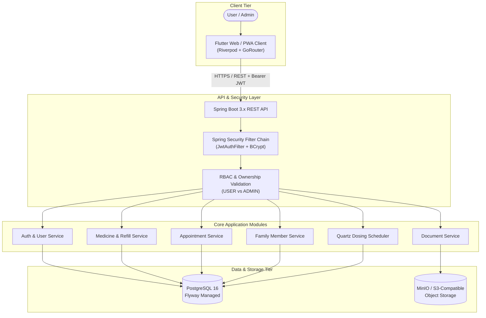

# CARESYNC

## Your Care. In Sync. On Time.

CareSync is a personal healthcare organization and reminder platform designed to help individuals and families centralize their medications, dosing schedules, family profiles, doctor appointments, medical documents, and inventory refills in a single, secure environment.

---

## Why CareSync?

Managing personal and family health is increasingly complicated. Vital healthcare information is frequently scattered across disparate paper prescriptions, calendar reminders, physical document folders, pharmacy receipts, and manual notes. This fragmentation leads to:

- Missed or mistimed medication doses
- Overlooked prescription expiration dates and unexpected medication stockouts
- Difficulty tracking dependents' medical history and upcoming visits
- Disorganized medical records during doctor consultations
- Insecure document handling across personal devices

CareSync addresses these challenges by centralizing healthcare organization into a unified, secure platform with automated reminder scheduling, proactive refill tracking, and role-based access control.

> **IMPORTANT DISCLAIMER**  
> CareSync is an administrative healthcare organization and reminder platform. It does **NOT** provide medical diagnosis, treatment recommendations, prescription generation, dosage recommendations, or automated medical decision-making. Users should always consult qualified healthcare professionals regarding any medical condition, diagnosis, or prescription regimen.

---

## Features

### User Features
- **Authentication & Sessions**: Self-service registration and login backed by stateless JWT authentication, secure credential storage, and automatic session restoration.
- **Unified Dashboard**: Real-time adherence indicators, today's schedule summary, quick-action shortcuts, and dynamic greeting with localized time and date.
- **Medication Management**: Comprehensive tracking of active medications, custom dosage instructions, frequencies, timing, and optional clinical notes.
- **Stock Tracking & Refill Alerts**: Real-time remaining medication quantity tracking with automated warning badges whenever stock dips below user-configured refill thresholds.
- **Family Profiles**: Manage dependent family members under a single primary account to coordinate pediatric, elder, or spousal care.
- **Public Community Directory**: Privacy-preserving directory enabling discovery of community members by display name only, without exposing private healthcare data.
- **Appointment Scheduling**: Log upcoming doctor consultations, hospital/clinic locations, consultation purposes, and reminder alert lead times.
- **Secure Medical Documents**: Upload, preview, and download medical records, lab results, and prescriptions with binary streaming and S3/MinIO isolation.
- **Profile Management**: View authenticated identity details, security status, and initiate secure sign-out.

### Admin & Role-Based Access Control (RBAC)
- **Role Hierarchy**: Two distinct roles (`USER` and `ADMIN`) strictly validated on the backend.
- **Admin Management Console**: Dedicated administrator dashboard displaying system user metrics (total users, active accounts, deactivated accounts, admin count).
- **User Directory & Account Controls**: Paginated and searchable directory enabling administrators to inspect user accounts, create new accounts, and update account states.
- **Activation & Deactivation**: Soft-delete account status toggling that immediately revokes login access for deactivated users while preserving underlying healthcare data integrity.
- **Role Elevation & Demotion**: Promotion of users to `ADMIN` and demotion of administrators to `USER`.
- **Last-Active-Admin Protection**: Concurrency-safe database validation preventing the system from ever reaching zero active administrators.
- **Authorized Healthcare Inspection**: Administrative read-only access to managed users' medicines, documents, appointments, and family profiles via lazy-loaded record dialogs.

### Security
- **Backend Authorization Enforcement**: Access control is enforced in Spring Security filters and `@PreAuthorize` method annotations, never solely on the client UI.
- **Resource Ownership & IDOR Protection**: Direct object references are strictly validated against the authenticated user's ID, preventing horizontal privilege escalation.
- **Password Security**: Strong password hashing using Spring Security's `BCryptPasswordEncoder`.
- **Stateless JWT Tokens**: Signed authentication tokens with configurable expiration and secret injection.
- **Disabled Account Lockout**: Blocked authentication for accounts flagged with `isActive: false`.
- **Environment Isolation**: Zero hardcoded credentials or fallback production secrets in source configuration; all sensitive keys are injected via environment variables.
- **Repository Cleanliness**: Git rules strictly ignore `.env`, credentials, certificates, and build artifacts.

---

## Tech Stack

| Layer | Technologies |
|---|---|
| **Frontend** | Flutter (3.x), Flutter Web / PWA, Riverpod, GoRouter, Dio |
| **Backend** | Java 21, Spring Boot 3.3.x, Spring Security, Spring Data JPA |
| **Database** | PostgreSQL 16 |
| **Database Migrations** | Flyway |
| **Scheduling** | Quartz Scheduler (Persistent JDBC JobStore) |
| **Object Storage** | MinIO (Local) / S3-Compatible Object Storage (Production) |
| **API Documentation** | Swagger / OpenAPI 3 (SpringDoc) |
| **Code Quality** | SonarQube |
| **Testing** | JUnit 5, Mockito, Spring Boot Test, Flutter Test |
| **Infrastructure & Deployment** | Docker, Docker Compose, Render (Target Deployment) |

---

## Architecture



---

## Project Structure

```text
CareSync/
├── backend/                  # Spring Boot REST API application
│   ├── src/main/java/        # Application modules (auth, medicine, appointment, family, document, user)
│   ├── src/main/resources/   # Application configuration and Flyway SQL migrations
│   └── pom.xml               # Maven dependencies and build configuration
├── mobile/                   # Flutter cross-platform client (Web / PWA and mobile)
│   ├── lib/                  # Application source (core, features, shared widgets)
│   ├── test/                 # Automated unit and widget tests
│   └── pubspec.yaml          # Flutter dependencies and asset declarations
├── web/                      # Static landing page assets
├── docker-compose.yml        # Local development infrastructure (PostgreSQL, Redis, MinIO)
├── .env.example              # Template configuration for environment variables
├── .gitignore                # Repository-wide exclusion rules
└── README.md                 # Project documentation
```

> **Note on Client**: The `mobile/` directory contains the unified Flutter codebase providing full Flutter Web/PWA support and responsive desktop/mobile viewports.

---

## API Documentation

CareSync exposes a RESTful API with automated OpenAPI 3 documentation:

- **Swagger UI**: [`http://localhost:8080/swagger-ui.html`](http://localhost:8080/swagger-ui.html)
- **OpenAPI JSON**: [`http://localhost:8080/v3/api-docs`](http://localhost:8080/v3/api-docs)
- **Health Actuator**: [`http://localhost:8080/actuator/health`](http://localhost:8080/actuator/health)

All protected endpoints require an `Authorization: Bearer <token>` header obtained via `/api/auth/login` or `/api/auth/register`. Administrative operations under `/api/v1/admin/**` additionally require the `ADMIN` role.

---

## Testing & Quality

All automated test suites pass locally:

### Backend Verification
- **Test Framework**: JUnit 5, Mockito, Spring Boot Integration Test
- **Test Count**: **54 / 54 passed** (0 failures, 0 errors, 0 skipped)
- **Status**: `BUILD SUCCESS`
- **Coverage**: Covers JWT authentication, last-admin concurrency safety, IDOR authorization barriers, medicine and stock bounds, appointment management, and administrative endpoints.

### Frontend Verification
- **Static Analysis**: `flutter analyze` — **No issues found** (0 errors, 0 warnings, 0 hints)
- **Widget & Unit Tests**: `flutter test` — **8 / 8 passed**
- **Production Web Build**: `flutter build web --release` — **Successful**

---

## Security & Privacy

1. **Healthcare Data Isolation**: Healthcare records (medicines, documents, appointments) are strictly private to their owning account. Normal users cannot access, modify, or view other users' records.
2. **Backend Enforcement**: Authorization is evaluated on the server. Hiding or showing UI elements is cosmetic; every API invocation validates permissions and identity.
3. **Account Protection**: Passwords meet length requirements and are stored as one-way BCrypt hashes.
4. **Environment Hygiene**: No production credentials, database passwords, or JWT signing keys are stored in version control. All values are sourced at runtime via environment variables.

---

## Production Deployment (Planned)

Production deployment is planned for [Render](https://render.com) using the following architecture:

- **Database**: Managed PostgreSQL on Render
- **Backend API**: Render Web Service (containerized Spring Boot Java 21)
- **Frontend Client**: Render Static Site (serving optimized `flutter build web --release` bundle)
- **Document Storage**: Managed S3-compatible cloud object storage
- **Configuration**: Managed environment variables configured securely in the Render Dashboard

*(Note: The platform is currently configured for local and development environments; production deployment on Render is the planned operational target).*

---

## Screenshots

> Screenshots coming soon.

---

## Local Development

### Prerequisites
- Java 21 JDK
- Apache Maven 3.9+
- Flutter SDK (3.22+)
- Docker & Docker Compose
- Google Chrome (for web testing)

### 1. Configure Environment
Copy `.env.example` to create your local environment file:
```bash
cp .env.example .env
```
Fill in your local passwords and configuration values.

### 2. Start Local Infrastructure
Launch PostgreSQL, Redis, and MinIO:
```bash
docker compose up -d
```
Verify containers are running:
```bash
docker compose ps
```

### 3. Run Backend
```bash
cd backend
mvn clean compile
mvn spring-boot:run
```
The backend starts on `http://localhost:8080`. Health check: `curl http://localhost:8080/actuator/health`.

### 4. Run Frontend (Web)
```bash
cd mobile
flutter pub get
flutter run -d chrome
```
To build the static web release bundle:
```bash
flutter build web --release
```
The production bundle will be generated in `mobile/build/web/`.

