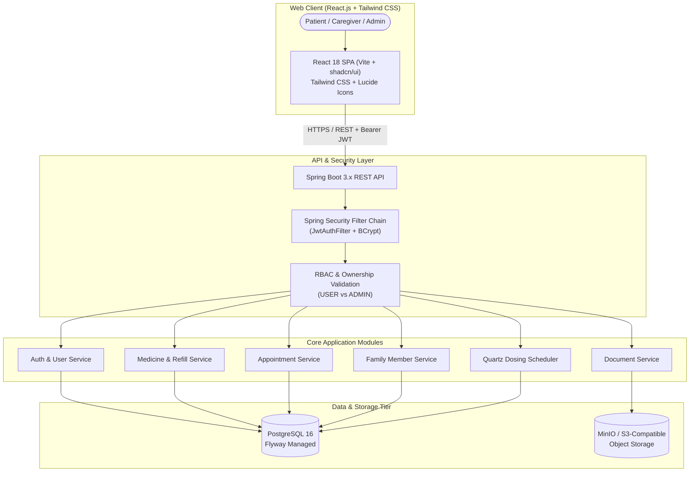

# CARESYNC

## Your Care. In Sync. On Time.

CareSync is a full-stack personal and family healthcare organization platform designed to help individuals and caregivers centralize medications, dosage schedules, family care circles, doctor appointments, medical documents, and inventory refill alerts in a single, secure web application.

---

## Why CareSync?

Managing personal and family healthcare is increasingly complicated. Vital healthcare information is frequently scattered across disparate paper prescriptions, calendar reminders, physical document folders, pharmacy receipts, and manual notes. This fragmentation leads to:

- Missed or mistimed medication doses
- Overlooked prescription expiration dates and unexpected medication stockouts
- Difficulty tracking dependents' medical history and upcoming visits
- Disorganized medical records during doctor consultations
- Insecure document handling across personal devices

CareSync addresses these challenges by centralizing healthcare organization into a unified, responsive web application with automated reminder scheduling, proactive refill tracking, role-based access control, and secure cloud medical record vaults.

> **IMPORTANT DISCLAIMER**  
> CareSync is an administrative healthcare organization and reminder platform. It does **NOT** provide medical diagnosis, treatment recommendations, prescription generation, dosage recommendations, or automated medical decision-making. Users should always consult qualified healthcare professionals regarding any medical condition, diagnosis, or prescription regimen.

---

## Features

### User & Patient Features
- **Authentication & Sessions**: Self-service registration and login backed by stateless JWT authentication, secure credential storage, and automatic session restoration.
- **Unified Dashboard**: Real-time adherence indicators, today's schedule timeline, refill warnings, upcoming doctor visits, and quick-action shortcuts.
- **Medication Management**: Comprehensive tracking of active medications, dosage strengths, multiple scheduled reminder times per day, weekly recurrence options, and clinical notes.
- **Stock Tracking & Refill Alerts**: Real-time remaining medication quantity tracking with automated warning badges whenever stock dips below user-configured refill thresholds.
- **Daily Dose Actions**: Interactive dose logging with live **Take Dose**, **Skip**, and **Snooze** (+15m, +30m, +60m) capabilities.
- **Family Care Circle**: Manage dependent family profiles (children, parents, spouses) under a single primary account to coordinate pediatric, elder, or spousal care.
- **Visits & Appointments**: Log upcoming doctor consultations, hospital/clinic locations, consultation purposes, and reminder alert lead times.
- **Secure Medical Documents**: Upload, preview, and download medical records, lab results, and prescriptions with binary streaming and S3/MinIO isolation.
- **Profile & Account Security**: View authenticated identity details, update passwords, and initiate secure sign-out.

### Admin & Role-Based Access Control (RBAC)
- **Role Hierarchy**: Two distinct roles (`USER` and `ADMIN`) strictly validated on the backend.
- **Admin Management Console**: Dedicated administrator dashboard displaying system user metrics (total users, active accounts, deactivated accounts, admin count).
- **User Directory & Account Controls**: Paginated and searchable directory enabling administrators to inspect user accounts, create new accounts, and update account states.
- **Activation & Deactivation**: Soft-delete account status toggling that immediately revokes login access for deactivated users while preserving underlying healthcare data integrity.
- **Role Elevation & Demotion**: Promotion of users to `ADMIN` and demotion of administrators to `USER`.
- **Authorized Healthcare Inspection**: Administrative read-only access to managed users' medicines, documents, appointments, and family profiles via lazy-loaded record dialogs.

### Security
- **Backend Authorization Enforcement**: Access control is enforced in Spring Security filters and `@PreAuthorize` method annotations, never solely on the client UI.
- **Resource Ownership & IDOR Protection**: Direct object references are strictly validated against the authenticated user's ID, preventing horizontal privilege escalation.
- **Password Security**: Strong password hashing using Spring Security's `BCryptPasswordEncoder`.
- **Stateless JWT Tokens**: Signed authentication tokens with configurable expiration and secret injection.
- **Disabled Account Lockout**: Blocked authentication for accounts flagged with `isActive: false`.

---

## Tech Stack

| Layer | Technologies |
|---|---|
| **Frontend Web App** | React 18, JavaScript (ES2022), Vite, Tailwind CSS, shadcn/ui patterns, Lucide Icons, Date-fns |
| **Backend API** | Java 21, Spring Boot 3.3.x, Spring Security, Spring Data JPA |
| **Database** | PostgreSQL 16 |
| **Database Migrations** | Flyway |
| **Scheduling** | Quartz Scheduler (Persistent JDBC JobStore) |
| **Object Storage** | MinIO (Local) / S3-Compatible Object Storage (Production) |
| **API Documentation** | Swagger / OpenAPI 3 (SpringDoc) |
| **Containerization** | Docker, Docker Compose, Nginx Alpine |

---

## Architecture



---

## Project Structure

```text
CareSync/
├── frontend/                 # Modern React.js + Tailwind CSS + shadcn/ui Web Application
│   ├── src/
│   │   ├── components/       # UI library (Button, Modal, Card, Select, Badge, Input) & Layout
│   │   ├── context/          # AuthContext (JWT & RBAC), ToastContext (Notifications)
│   │   ├── pages/            # Feature pages (Dashboard, Medicines, Reminders, Visits, Family, Docs, Admin, Profile)
│   │   ├── services/         # Axios/Fetch API client with JWT interceptors & blob streaming
│   │   └── utils/            # Styling utility helpers (clsx, tailwind-merge)
│   ├── index.html            # HTML entry point with Plus Jakarta Sans typography
│   ├── vite.config.js        # Vite bundler configuration & local API proxy
│   ├── tailwind.config.js    # Tailwind theme configuration
│   ├── Dockerfile            # Multi-stage production build (Node 20 + Nginx Alpine)
│   └── nginx.conf            # Nginx SPA fallback routing & asset caching
├── backend/                  # Spring Boot REST API application
│   ├── src/main/java/        # Application modules (auth, medicine, appointment, family, document, user)
│   ├── src/main/resources/   # Application configuration and Flyway SQL migrations
│   ├── Dockerfile            # Multi-stage production build (Eclipse Temurin Java 21)
│   └── pom.xml               # Maven dependencies and build configuration
├── docker-compose.yml        # Fullstack local container orchestration (PostgreSQL, MinIO, Redis, Backend, Frontend)
└── README.md                 # Project documentation
```

---

## API Documentation

CareSync exposes a RESTful API with automated OpenAPI 3 documentation:

- **Swagger UI**: [`http://localhost:8080/swagger-ui.html`](http://localhost:8080/swagger-ui.html)
- **OpenAPI JSON**: [`http://localhost:8080/v3/api-docs`](http://localhost:8080/v3/api-docs)
- **Health Actuator**: [`http://localhost:8080/actuator/health`](http://localhost:8080/actuator/health)

All protected endpoints require an `Authorization: Bearer <token>` header obtained via `/api/auth/login` or `/api/auth/register`. Administrative operations under `/api/v1/admin/**` additionally require the `ADMIN` role.

---

## Local Development & Setup

### Prerequisites
- Node.js 20+ & npm
- Java 21 JDK & Maven 3.9+
- Docker & Docker Compose

### 1. Start Infrastructure via Docker Compose
Launch PostgreSQL, Redis, and MinIO:
```bash
docker compose up -d postgres minio redis
```

### 2. Run Backend
```bash
cd backend
mvn spring-boot:run
```
The backend will start on `http://localhost:8080`.

### 3. Run Frontend (React Dev Server)
```bash
cd frontend
npm install
npm run dev
```
Open `http://localhost:5173` in your browser. The Vite development server will automatically proxy API requests to `http://localhost:8080`.

### 4. Build Production Bundle
To create an optimized production build of the React web app:
```bash
cd frontend
npm run build
```
The production bundle will be created in `frontend/dist/`.
